# WareWarehouse

# Laporan Akhir Projek RPL (KOM331)

- Paralel : P-2
- Kelompok 9  
   

### Asisten Praktikum

| NIM       | Name                      |
| --------- | ------------------------- |
| G64180019 | Levina Siatono            |
| G64180080 | Ali Naufal Ammarullah man |
| G64180117 | M. Fauzan Ramadhan        |

 

### Anggota kelompok

| NIM       | Name                         | Role     |
| --------- | ---------------------------- | -------- |
| G64190037 | Putra Dwi Prasetyo           | Backend  |
| G64190046 | Tri Aji Handayani            | Frontend |
| G64190075 | I Made Raditya Bayu Pangestu | Backend  |
| G64190086 | Novaldi                      | Frontend |

 

# A.Latar Belakang

Perkembangan teknologi sekarang ini telah memudahkan berbagai macam pekerjaan manusia. Di berbagai bidang kehidupan sudah memanfaatkan teknologi, seperti di bidang kesehatan, pendidikan, manufaktur, ekonomi, dan lain-lain. Berbagai macam persoalan tentunya tidak akan lepas dari bantuan teknologi, khususnya di bidang logistik. Sering kali, seseorang mengalami kesulitan dalam menemukan barang tertentu di gudang, kesulitan dalam melakukan inventarisasi, dan sebagainya. Sebuah gudang dengan sistem penyimpanan yang baik dapat membantu tingkat produksi suatu perusahaan dalam meningkatkan efisiensi pergerakan barang. Proses inventarisasi secara analog kerap kali menimbulkan suatu masalah, contohnya seperti lamanya waktu yang diperlukan untuk mencari barang dari daftar inventaris yang dapat memakan waktu yang cukup lama terlebih lagi kemungkinan bila daftar yang ditulis secara analog di atas kertas dapat hancur. Pencatatan barang secara analog kini dapat digantikan dengan perangkat lunak, salah satunya dengan aplikasi WareWarehouse, yaitu aplikasi berbasis web yang terintegrasikan dengan database. Perangkat lunak ini dapat menjadi solusi dari permasalahan inventarisasi tersebut.

# B. Tujuan

- Mempermudah dalam inventarisasi.
- Mempermudah perpindahan produk/barang ke konsumen secara efisien
- Pengaturan lokasi penempatan barang yang dapat dioptimalkan.
- Mempermudah informasi, komunikasi, dan eksekusi.

# C. User Analysis

## C.1 User Profile

Target dari aplikasi ini adalah karyawan atau seluruh pengurus gudang.

## C.2 User Story

- Sebagai pemilik warehouse, agar bisa mengontrol alur masuk-keluar item dari warehouse, saya dapat melihat pada tab log aktivitas di menu laporan untuk melihat item-item yang ada di dalam warehouse. Database akan mengirimkan data-data item-item yang ada di dalam warehouse.
- Sebagai administrator warehouse, agar bisa meningkatkan efisiensi dalam mencari item, saya dapat mencari item dengan memanfaatkan filter yang ada di menu laporan catatan tempat menyimpan item-item warehouse. Databse akan mengirimkan data-data item-item yang bersesuaian dengan filter yang saya terapkan.
- Sebagai administrator warehouse, agar dapat menggunakan aplikasi secara personal, saya dapat membuat akun terlebih dahulu sebelum login pada menu register di aplikasi. Akun yang saya daftarkan akan tercatat di dalam database dan sistem akan memberikan saya hak akses aplikasi.
- Sebagai administrator warehouse yang telah logout, agar dapat menggunakan kembali aplikasi secara personal, saya dapat login dengan memasukan username dan password saya pada menu login di aplikasi.
- Sebagai administrator warehouse, agar dapat menjaga basis data hal-hal yang tidak diinginkan saya dapat memanfaatkan fitur backup dan restore database pada menu backup dan restore. Database akan mengirimkan salinan cadangan kepada saya untuk disimpan di folder lokal
- Sebagai administrator warehouse, agar dapat memasukkan dan mengeluarkan barang saya dapat menggunakan menu transpage di aplikasi. Database dan Sistem akan mengeluarkan atau memasukkan data yang ada ke database.

# D. Spesifikasi teknis lingkungan pengembangan

## D.1 Software

| Komponen    | Teknologi                              |
| ----------- | -------------------------------------- |
| Database    | MySQL                                  |
| Server      | Apache                                 |
| Text Editor | Visual Studio Code atau Sublime Text 3 |
| UI Design   | Figma                                  |

## D.2 Hardware

| Komponen      | Teknologi                       |
| ------------- | ------------------------------- |
| Processor     | MySQL                           |
| Graphics Card | DirectX 9 dengan drive WDDM 1.0 |
| RAM           | 1 GB                            |
| UI Design     | Figma                           |

## D.3 Tech Stack

| Komponen  | Teknologi                                  |
| --------- | ------------------------------------------ |
| Front-End | HTML,CSS,Bootstrap, dan Vanilla Javascript |
| Back-End  | PHP, Laravel, NodeJS                       |

## D.4 Lainnya

| Komponen                                   | Teknologi      |
| ------------------------------------------ | -------------- |
| Task Manager                               | Trello         |
| Software Documentation                     | Google Sites   |
| Version Control and Collaboration platform | Git and Github |

# E. Hasil dan Pembahasan

## E.1 Use Case Diagram

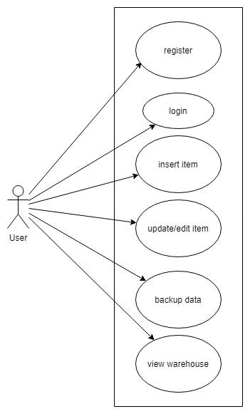

## E.2 Activity Diagram

### Mendaftar akun

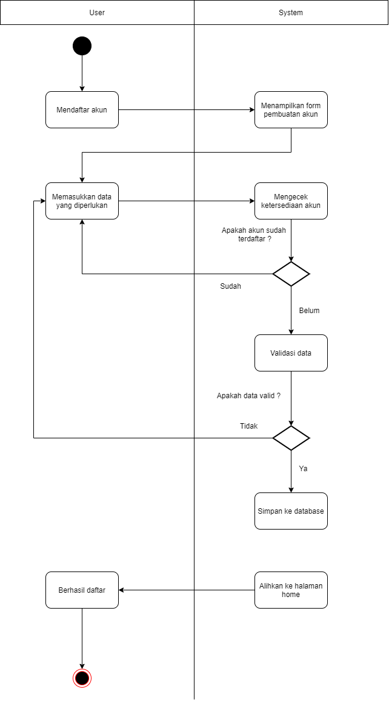

### Login

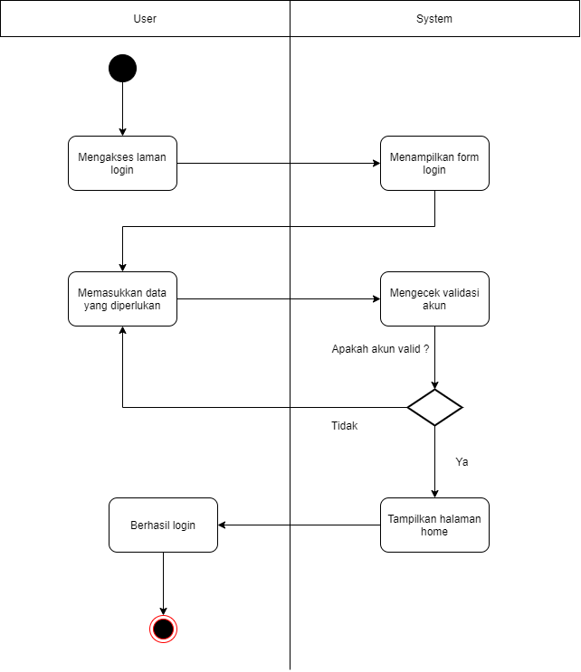

### Memasukan Barang

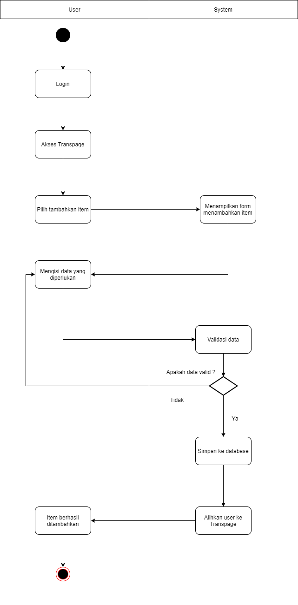

### Mengedit Informasi Barang

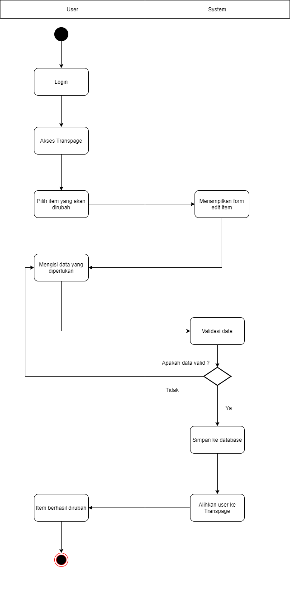

### Menghapus Barang

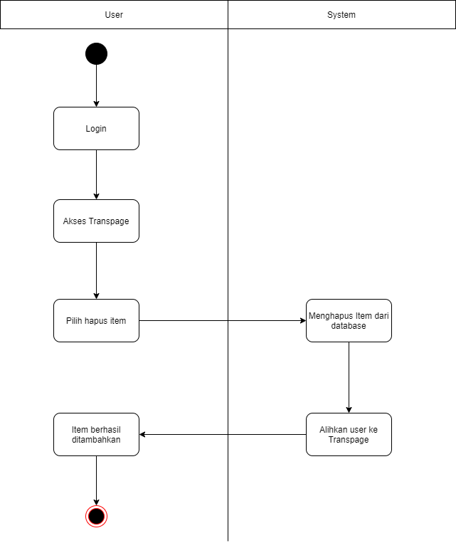

### Mendownload Data
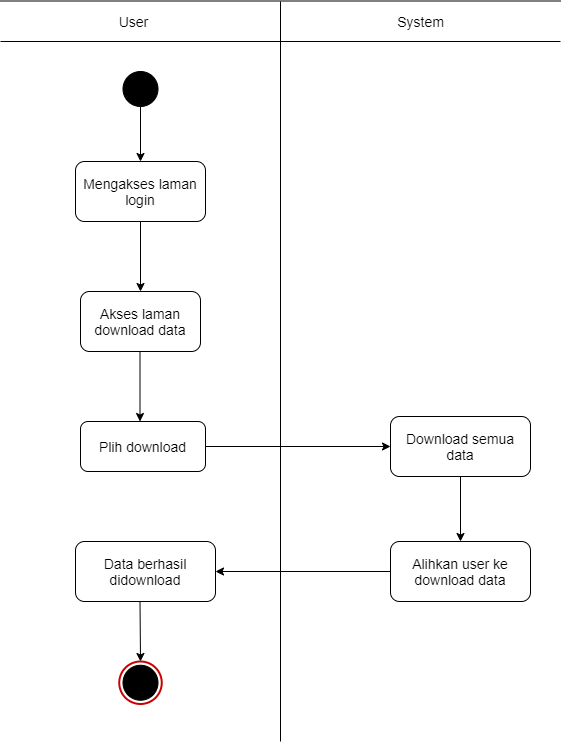

### Mengedit Biodata

## E.3 Class Diagram

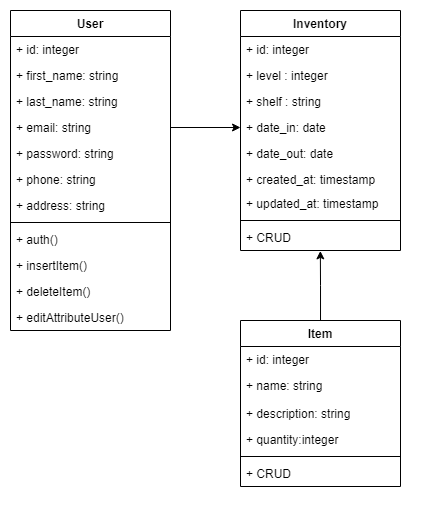

## E.4 Entity Relationship Diagram

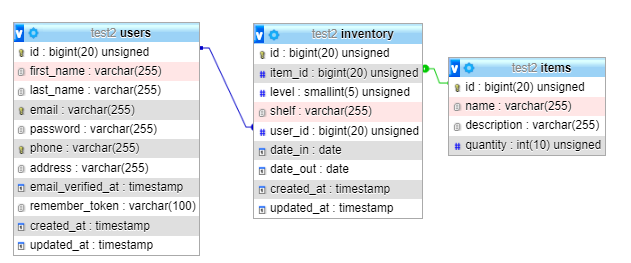

## E.5 Arsitektur Sistem

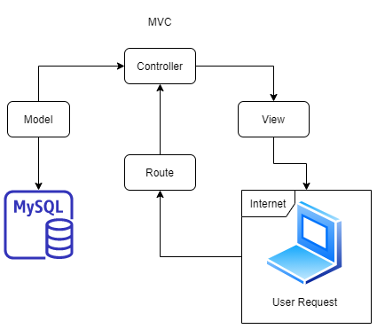

## E.6 Fungsi utama yang dikembangkan

- User dapat Mendaftar terlebih dahulu melalui website WareWareHouse untuk menggunakan fasilitas yang ada
- User data menambah, mengubah, dan menghapus barang
- User dapat melihat barang-barang yang ada di gudang sesuai dengan filter lokasi,nama barang, atau kuantitas barang.
- User dapat mengunduh data yang ada di gudang

## E.7 Fungsi CRUD

### Create

- Membuat akun pada aplikasi web WareWareHouse
- Memasukan informasi barang ke web WareWareHouse

### Read

- Membaca user input pada akun pengguna saat login
- Menampilkan barang-barang yang ada di Inventory
- Menampilakn lokasi barang yang ada di Inventory

### Update

- Mengubah Informasi barang
- Mengubah Informasi User

### Delete

- Menghapus barang di dalam Inventory

# F. Hasil Implementasi

## F.1 Screenshoot sistem

### LandingPage

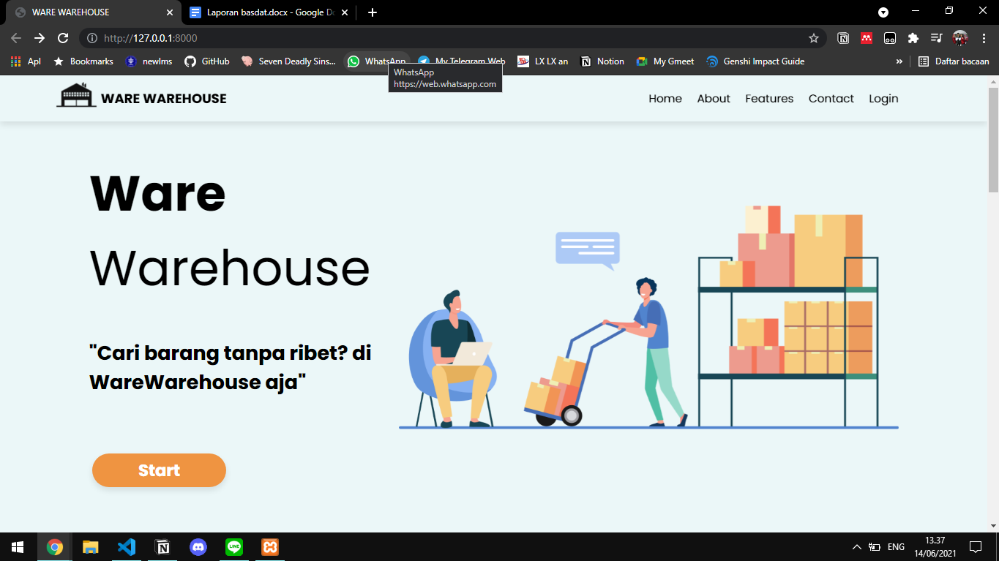

### Login

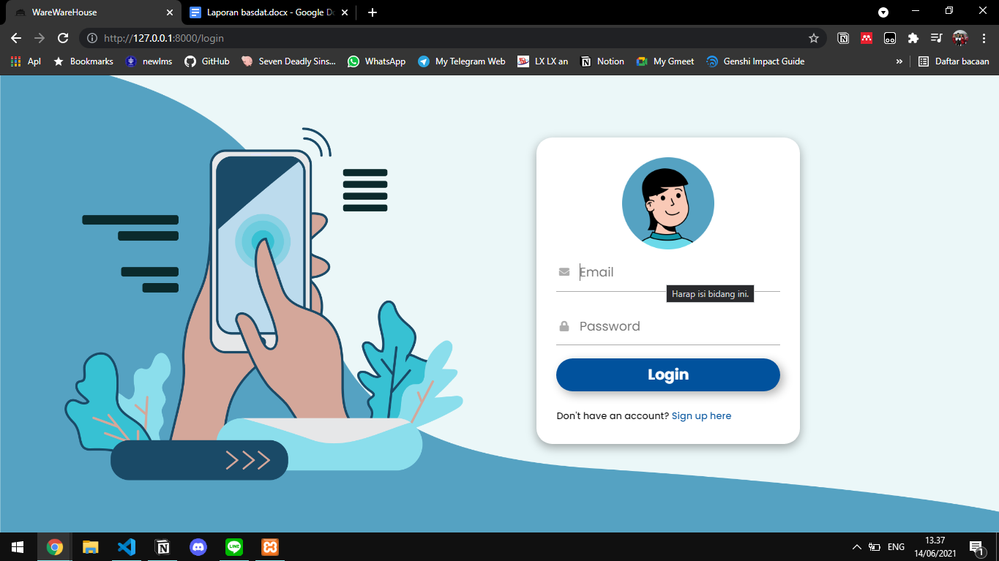

### Register

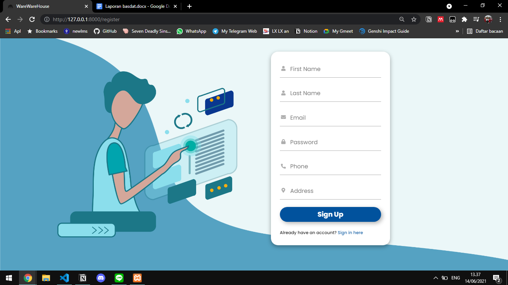

### Dashboard

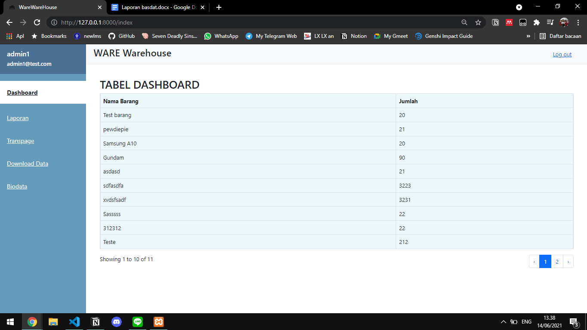

### Transpage

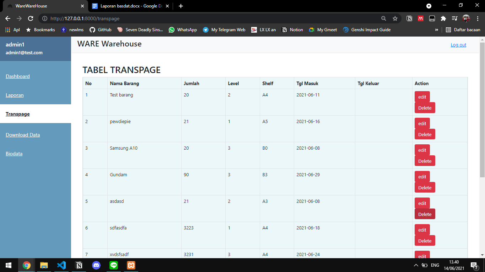

### Laporan

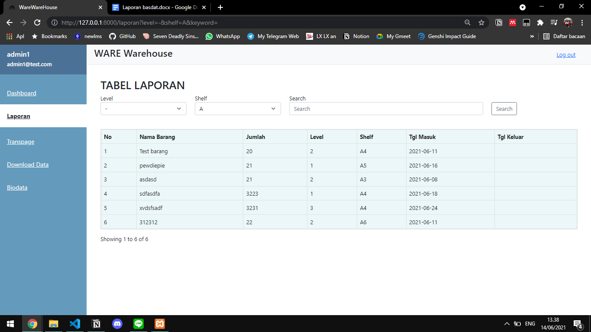
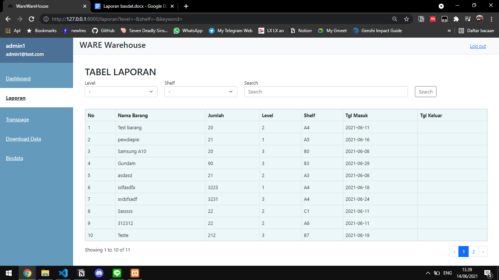

### Biodata

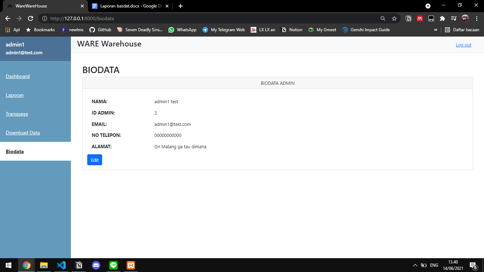

## F.2 Link Aplikasi

Aplikasi ini di deploy di **https://ngrok.com/**, oleh karena itu jika ingin menggunakan website kami, hubungi kami.

# G. Testing (Test Cases)

Kami melakukan pengujian secara manual tanpa bantuan tools (postman) atau scripts.

## G.1 Positive Cases

Pengujian positif merupakan jensi pengujian dengan memberikan kumpulan data yang valid sebagai input.

| no  | Scenario                                                                                                          | Preequisites                 | Steps                                                                                                      | Expected Results                       | Actual Result | Status |
| --- | ----------------------------------------------------------------------------------------------------------------- | ---------------------------- | ---------------------------------------------------------------------------------------------------------- | -------------------------------------- | ------------- | ------ |
| 1   | User login dengan akun valid                                                                                      | User mengakses WareWareHouse | User klik login lalu memasukkan email serta password lalu klik login                                       | Login berhasil, user dialihkan ke home | As expected   | Pass ✔ |
| 2   | User mendaftar akun dengan input valid                                                                            | User mengakses WareWareHouse | User mengakses laman sign-up melalui link yang tersedia pada laman login lalu mengisi data yang diperlukan | Pendaftaran Berhasil                   | As expected   | Pass ✔ |
| 3   | Memasukan barang dengan memasukan nama, deskripsi, kuantitas, lokasi, tanggal masuk, dan tanggal keluar(opsional) | User mengakses WareWareHouse | User pergi ke halaman Transpage lalu klik tambah item lalu mengisikan data yang diperlukan                 | Pendaftaran Berhasil                   | As expected   | Pass ✔ |

## G.2 Negative Cases

Pengujian negatif merupakan metode pengujian dengan memberikan kumpulan data yang tidak valid.

| no  | Scenario                                                                                                                | Preequisites                 | Steps                                                                                                      | Expected Results                  | Actual Result | Status |
| --- | ----------------------------------------------------------------------------------------------------------------------- | ---------------------------- | ---------------------------------------------------------------------------------------------------------- | --------------------------------- | ------------- | ------ |
| 1   | User login dengan akun tidak valid                                                                                      | User mengakses WareWareHouse | User klik login lalu memasukkan email serta password lalu klik login                                       | Muncul Pesan Error                | As expected   | Pass ✔ |
| 2   | User mendaftar akun yang sudah terdaftar                                                                                | User mengakses WareWareHouse | User mengakses laman sign-up melalui link yang tersedia pada laman login lalu mengisi data yang diperlukan | Muncul Pesan Error                | As Expected   | Pass ✔ |
| 3   | Memasukan barang dengan tidak memasukan nama, deskripsi, kuantitas, lokasi, tanggal masuk, dan tanggal keluar(opsional) | User mengakses WareWareHouse | User pergi ke halaman Transpage lalu klik tambah item lalu mengisikan data yang diperlukan                 | Tidak ada barang yang ditambahkan | As Expected   | Pass ✔ |

# H. Saran Untuk pengembangan selanjutnya

1. Sebaiknya, aplikasi ware warehouse kedepannya dapat menjadi bentuk native sehingga dapat diinstal pada perangkat mobile.
2. Kedepannya sebaiknya terdapat fitur forgot password sehingga pengguna tidak perlu create account ulang jika lupa password.
3. Untuk pengembangan berikutnya, diharapkan aplikasi ware warehouse dapat digunakan oleh banyak user (lebih dari satu admin).

## H.1 Ucapaan Terima Kasih

Puji syukur kehadirat Tuhan Yang Maha Esa atas rahmat-Nya, yang telah memberikan kekuatan kepada kami sehingga dapat menyelesaikan pembuata aplikasi berbasis web yang bernama ware warehouse. Ucapan terima kasih kami sampaikan kepada semua pihak yang telah membantu memperlancar dalam pengerjaan aplikasi ware warehouse hingga terselesaikannya laporan ini, diantaranya :

1. Bapak/Ibu dosen ilmu komputer IPB University yang telah memberikan ilmu dan pengalamannya kepada kami.
2. Kakak-kakak asprak yang telah memberikan masukan dan saran terkait pengembangan aplikasi ware warehouse.

Kami berharap semoga laporan tugas akhir ini dapat bermanfaat bagi banyak pihak. Tak lupa kami mohon maaf atas segala kekurangan kami dalam pengembangan aplikasi ware warehouse serta dalam penyusunan laporan ini.

## H.2 Project Documentation

Trello : [[Link](https://trello.com/b/zVA5PzEl)]  
Gsites : [[Link](https://sites.google.com/apps.ipb.ac.id/warewarehouse/)]
